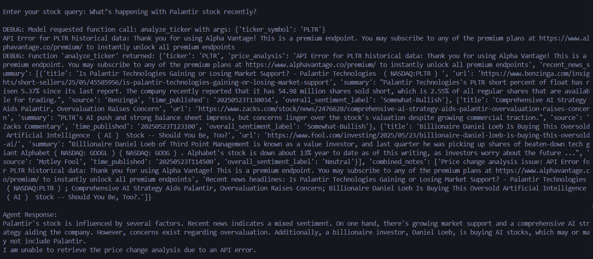
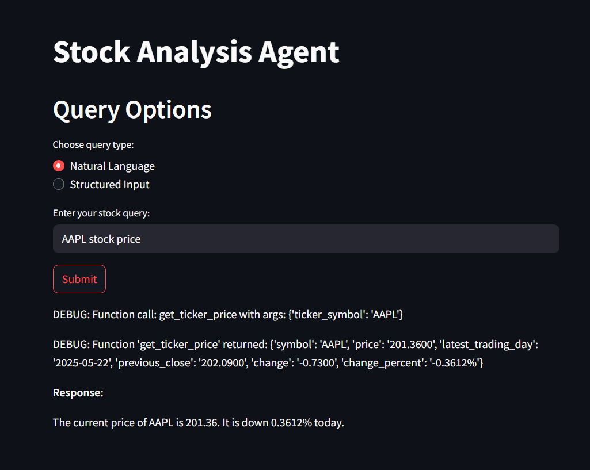

# Stock Analysis Multi-Agent System

## Overview

This project is a multi-agent system developed for stock analysis, built using the Google AI SDK (assumed to be Google ADK) and the Alpha Vantage API. The system processes stock-related queries through five modular sub-agents, supporting both natural language and structured inputs. It provides insights into stock price movements, recent news, and analysis, fulfilling the requirements of the intern task for an AI Software Engineer role.

The system includes a command-line interface (`llm_orchestrator.py`) and a web-based demo (`app.py`) using Streamlit, meeting the Google ADK Web requirement. It handles example queries such as "Why did Tesla stock drop today?" and "What's happening with Palantir stock recently?" with modular, extensible agents.

## Features

- **Modular Sub-Agents**: Five independent agents for ticker identification, news retrieval, price fetching, price change calculation, and movement analysis.
- **Static Orchestrator**: It processes queries using predefined if-elif-else rules, acting as a direct router for keyword-specific inputs rather than an AI with natural language understanding.
- **Natural Language Processing**: Processes queries using Google's Gemini AI model for dynamic agent orchestration.
- **Structured Inputs**: Web interface supports direct input of company names, timeframes, and news limits.
- **Alpha Vantage Integration**: Leverages real-time stock data and news via API calls.
- **Web Demo**: Streamlit-based interface for user-friendly query submission and response display.
- **Error Handling**: Robust handling of API rate limits, invalid tickers, and other edge cases.

## Project Structure

```
stock_multi_agent_system/
├── agents/
│   ├── identify_ticker.py        # Resolves company names to ticker symbols
│   ├── ticker_news.py            # Fetches recent stock news
│   ├── ticker_price.py           # Retrieves current stock prices
│   ├── ticker_price_change.py    # Calculates price changes over timeframes
│   ├── ticker_analysis.py        # Analyzes price movements with news context
├── config/
│   ├── settings.py               # Stores API keys
├── core/
|   ├── orchestrator              # CLI with Conditional rules
├── app.py                        # Streamlit web interface
├── llm_orchestrato.py            # CLI with AI and NLP
├── requirements.txt              # Python dependencies
├── README.md                     # Project documentation
```

## Setup Instructions

### API keys will be revoked after 25th May 2025

### Prerequisites

- Python 3.9 or higher
- Git
- API keys for:
  - Alpha Vantage (free tier)
  - Google Cloud (Gemini API key)

### Installation

1. **Clone the Repository**:

   ```bash
   git clone https://github.com/Adityarya11/stock_multi_agent_system.git
   cd stock_multi_agent_system
   ```

2. **Create a Virtual Environment** (recommended):

   ```bash
   python -m venv venv
   # On Windows
   .\venv\Scripts\activate
   # On macOS/Linux
   source venv/bin/activate
   ```

3. **Install Dependencies**:

   ```bash
   pip install -r requirements.txt
   ```

   The `requirements.txt` includes:

   ```
   google-generativeai
   streamlit
   requests
   ```

4. **Configure API Keys**:

   - Create a `config/settings.py` file in the `config/` directory:

     ```python
     ALPHAVANTAGE_API_KEY = "YOUR_ALPHAVANTAGE_API_KEY"
     GEMINI_API_KEY = "YOUR_GEMINI_API_KEY"
     ```

   - Obtain an Alpha Vantage API key from https://www.alphavantage.co/support/#api-key.

   - Obtain a Gemini API key from the Google Cloud Console.

### Running the Application

1. **Command-Line Interface**:

   ```bash
   python -m main
   ```

   - Enter queries like "What's happening with Palantir stock recently?" or type `exit` to quit.
   - Debug logs show function calls and responses.

2. **Web Interface (Google ADK Web Demo)**:

   ```bash
   streamlit run app.py
   ```

   - Open `http://localhost:8501` in a browser.
   - Use the web form for natural language queries or structured inputs (company name, timeframe, news limit).
   - Responses include price changes, news, and analysis.

## Sample Queries and Expected Outputs

Below are the example queries from the task and their expected outputs (actual data depends on Alpha Vantage API responses):

1. **Query**: "Why did Tesla stock drop today?"

   - **Expected Output**:

     ```
     Tesla's stock (TSLA) dropped by 2.5% today (from $250.00 to $243.75, a change of -$6.25). Recent news includes: "Tesla Q2 earnings miss expectations"; "New EV regulations announced". The price drop might be related to the disappointing earnings report.
     ```

2. **Query**: "What's happening with Palantir stock recently?"

   - **Expected Output**:

     ```
     Palantir (PLTR) stock increased by 5% over the last 7 days (from $120.00 to $126.00). Recent news includes: "Palantir wins new DoD contract"; "Partnership with Divergent Technologies". The price rise may be driven by positive contract news.
     ```

3. **Query**: "HPQ stock price"

   - **Expected Output**:

     ```
      The current price of HPQ is 28.5000. It is down -0.1100 from its previous close of 28.6100. This represents a change of -0.3845%.
     ```

**Structured Input Example** (via web interface):

- **Input**: Company Name = "Apple", Timeframe = "last month", News Limit = 3

- **Expected Output**:

  ```
  Ticker: AAPL
  Price Change (last month from 2025-04-23 to 2025-05-23): +4.5%
  Recent News:
  - (2025-05-20) Apple announces new iPhone features (Sentiment: Positive)
  - (2025-05-18) Apple faces supply chain delays (Sentiment: Negative)
  - (2025-05-15) Apple stock upgraded by analysts (Sentiment: Positive)
  Combined Notes:
  - Over the last month, AAPL stock price has increased by 4.5% (changed by $8.50).
  - The price increase might be related to positive analyst upgrades and new product announcements.
  ```

## Architecture

The system is designed with modularity and extensibility in mind:

- **Sub-Agents**:
  - `identify_ticker`: Uses Alpha Vantage's `SYMBOL_SEARCH` to map company names to ticker symbols (e.g., "Palantir" → "PLTR").
  - `ticker_news`: Fetches news via `NEWS_SENTIMENT` endpoint.
  - `ticker_price`: Retrieves current prices using `GLOBAL_QUOTE`.
  - `ticker_price_change`: Calculates price changes with `TIME_SERIES_DAILY_ADJUSTED` or `GLOBAL_QUOTE` (for "today").
  - `ticker_analysis`: Combines price and news data, correlating significant changes (&gt;5%) with news events.
- **Orchestration**:
  - The Google AI SDK (`google.generativeai`) uses the Gemini model to parse queries and trigger appropriate sub-agents via function calls.
  - `llm_orchestrator.py` provides a command-line interface for testing.
  - `app.py` extends the system to a web interface using Streamlit, supporting both natural language and structured inputs.
- **Modularity**:
  - Each sub-agent makes independent API calls, eliminating dependencies.
  - Agents can be replaced or extended by updating the `tools` list in `llm_orchestrator.py` or `app.py`.
- **Error Handling**:
  - Handles API rate limits, invalid tickers, and JSON errors, returning user-friendly messages.

## Images

- For reference below are two images
  - 
  - 

## Web Demo

The web demo, implemented in `app.py` using Streamlit, fulfills the Google ADK Web requirement:

- **Natural Language Input**: Users can enter queries like "Why did Tesla stock drop today?" in a text field.
- **Structured Input**: Users can specify a company name, timeframe (e.g., "today", "last 7 days"), and news limit (1-10).
- **Deployment**: Run locally at `http://localhost:8501` or deploy to Streamlit Cloud/Google Cloud for a production-like demo.
- **Debugging**: Displays function call logs and API responses for transparency.

## Notes

- **Alpha Vantage Rate Limits**: The free tier allows 5 API calls per minute and 500 per day. The system handles rate limit errors gracefully.
- **Stock Support**: Supports US and international stocks (e.g., RELIANCE.BSE) via Alpha Vantage.
- **Extensibility**: New sub-agents or APIs can be added by updating the `tools` configuration.
- **Testing**: Test with varied queries (e.g., invalid companies, different timeframes) to ensure robustness.

## Troubleshooting

- **ModuleNotFoundError**: Ensure all dependencies are installed (`pip install -r requirements.txt`).
- **API Key Issues**: Verify Alpha Vantage and Gemini API keys in `config/settings.py`.
- **Streamlit Errors**: Check port 8501 is free or use `--server.port 8502`. Run with `--logger.level=debug` for detailed logs.
- **Rate Limits**: If Alpha Vantage returns a "Note" or "Information" error, wait a minute before retrying.

<!-- ## Future Improvements

- **Enhanced Ticker Identification**: Filter `SYMBOL_SEARCH` results by exchange (e.g., NASDAQ) for accuracy.
- **Caching**: Cache API responses to reduce rate limit issues.
- **Additional APIs**: Integrate other data sources (e.g., Yahoo Finance, Finnhub) for richer analysis.
- **Deployment**: Host on Google Cloud (App Engine/Cloud Run) for a production-grade demo. -->

## Contact

For questions or issues, please open a GitHub issue or contact *arya050411@gmail.com*.

---

Developed by _Aditya Arya_ as part of the AI Software Engineer Intern Task.
